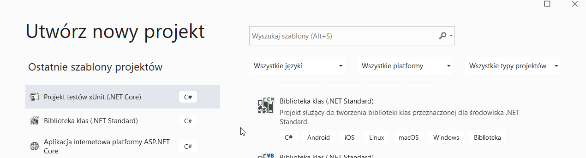
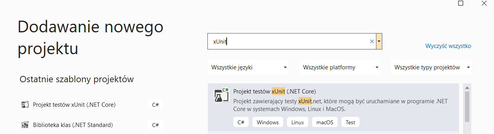
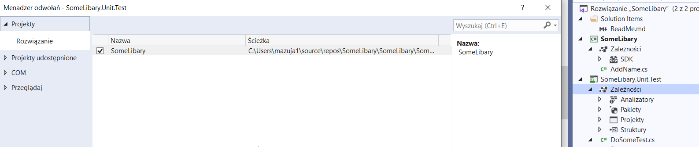

Testowanie Automatyczne z Uzyciem xUnit.net oraz IntelliTest 
Rozwiazanie wykonane w Visual Studio Profesional 2019 (IntelliTest nie dostepna dla Visual Studio Comunity) 
 

1 Utwórz nawy Projekt Bibliteka Klas(Standard) o nazwie SomeLibary

2 Dodaj prost¹ klase dodawanie Imienia 

using System;

namespace SomeLibary
{
    public class AddName
    {
        public string GetName(string name) 
        {
            return $"Pan {name}";
        }
    }
}

3 Dodaj nowy projekt testowy xUnit o nazwie SomeLibary.Unit.Test

4 Dodaj owo³anie do metod klasy SomeLibary

5 Utwórz kalse testow¹ o nazwie DoSomeTest

using System;
using Xunit;

namespace SomeLibary.Unit.Test
{
    public class DoSomeTest
    {
        [Fact]
        public void SholuldRerurnName()
        {
            //given 
            string name = "Artur";
            string expectedName = "Pan Artur";
            var doStuff = new  AddName();

            //when 
          string actualName = doStuff.GetName(name);

            //then
            Assert.Equal(expectedName, actualName);
        }
    }
} 

6 uruchom testy skórt klawiszowy: (crt + r + t)

