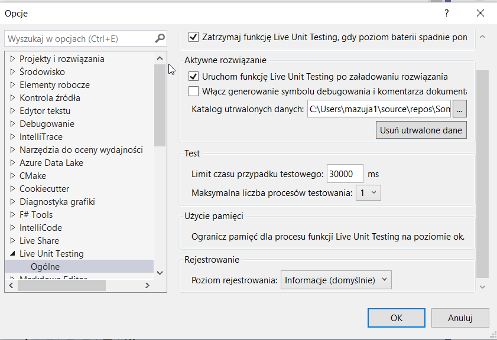
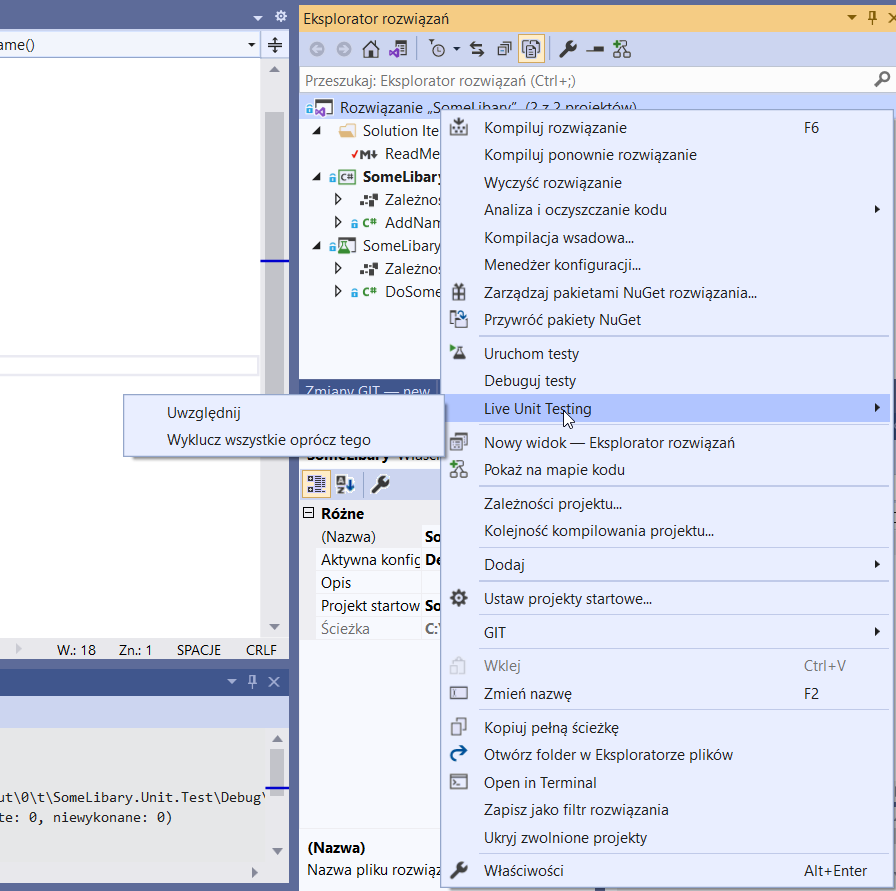
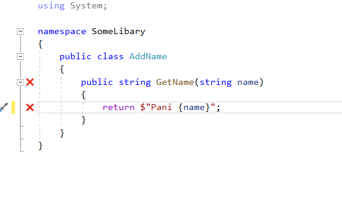
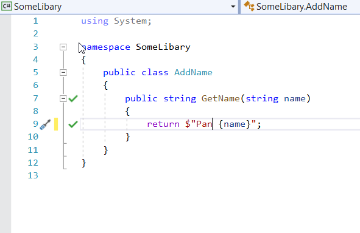

Testowanie Automatyczne z Uzyciem xUnit.net oraz IntelliTest 
 
 
Strona projektu: https://xunit.net
Link do dokumentacji Microsoft:
https://docs.microsoft.com/pl-pl/dotnet/core/testing/unit-testing-with-dotnet-test

xUnit.net jest darmowym, otwartym, społecznościowym narzędziem do testowania jednostkowego dla platformy .NET Framework. 
Napisana przez pierwotnego wynalazcę NUnit v2, xUnit.net jest najnowszą technologią do testowania jednostkowego języków C #, F #, VB.NET i innych języków .NET. 
xUnit.net współpracuje z ReSharper, CodeRush, TestDriven.NET i Xamarin. Jest częścią .NET Foundation i działa zgodnie z jej kodeksem postępowania . 
Jest licencjonowany w ramach Apache 2 (licencja zatwierdzona przez OSI).

Proste użycie testowania XUnit w projekcie (dodawanie Imienia Uzytkownika w C#)
Rozwiazanie wykonane w Visual Studio Profesional 2019 

1) Utwórz nawy Projekt Bibliteka Klas(Standard) o nazwie SomeLibary

2) Dodaj prostą klase dodawanie Imienia 

using System;

namespace SomeLibary
{
    public class AddName
    {
        public string GetName(string name) 
        {
            return $"Pan {name}";
        }
    }
}

3) Dodaj nowy projekt testowy xUnit o nazwie SomeLibary.Unit.Test

4) Dodaj owołanie do metod klasy SomeLibary

5) Utwórz kalse testową o nazwie DoSomeTest

using System;
using Xunit;

namespace SomeLibary.Unit.Test
{
    public class DoSomeTest
    {
        [Fact]
        public void SholuldRerurnName()
        {
            //given 
            string name = "Artur";
            string expectedName = "Pan Artur";
            var doStuff = new  AddName();

            //when 
          string actualName = doStuff.GetName(name);

            //then
            Assert.Equal(expectedName, actualName);
        }
    }
} 

6) uruchom testy skórt klawiszowy: (crt + r + t)

Dodwanie IntelliTest (IntelliTest moze być nie dostepna dla bezpłatnego Visual Studio Comunity )
Tastuje nasze metody w czasie rzeczywistym dając informacje że coś moze jest nie tak w naszej metodzie
faje narzędzie testowania kodu dla mniej dowiadczonych lub przemeczonych programistów.

Dokumentacja Microsoft :https://docs.microsoft.com/pl-pl/visualstudio/test/generate-unit-tests-for-your-code-with-intellitest?view=vs-2019
https://docs.microsoft.com/en-us/visualstudio/test/generate-unit-tests-for-your-code-with-intellitest?view=vs-2019

1) Dodawanie IntelliTest w VS 2019 
Narzdzia > Opcje > Live Unit Testing > Ogólne 

2) Włączanie Usługi IntelliTest w prjekcie

Solucja right click > Live Unit Testing > Uwzględnij

3) Teraz prz naszych metodach i zniennych bedą sie pojawić ptaszki gdy Ok i kryzyki dla błędów
zmaina przedrostka Imienia zmieni ptaszka na krzyzyk w metodzie GetName

 

